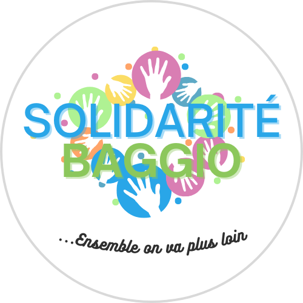

# Projet d'Identité Visuelle pour SOLIDARITÉ BAGGIO

**Introduction**

Ce projet vise à développer une identité visuelle forte et cohérente pour l'association SOLIDARITÉ BAGGIO, basée au lycée César Baggio à Lille. L'association soutient les étudiants en situation de précarité et a pour objectif de renforcer sa visibilité et sa communication.

**Contexte**

* **Association :** SOLIDARITÉ BAGGIO
* **Mission :** Aider les étudiants en situation de précarité
* **Lieu :** Lycée César Baggio, Lille
* **Site Web :** À venir

**Objectifs du Projet**

* Créer une identité visuelle qui reflète les valeurs de solidarité, d'entraide et de soutien de l'association.
* Concevoir un logo moderne et mémorable, en tenant compte du logo existant.
* Définir une palette de couleurs et une typographie adaptées à la communication de l'association.
* Élaborer des supports de communication visuels (affiches, flyers, publications sur les réseaux sociaux, etc.).
* Assurer la cohérence de l'identité visuelle sur tous les supports.

**Membres de l'Équipe**

* [Enzo](mailto:enzo.mensier@gmail.com)
* [Wicra](mailto:wicramachine@gmail.com)

**Calendrier**

* Création du Dêpot GitHub : 27 mars 2025
